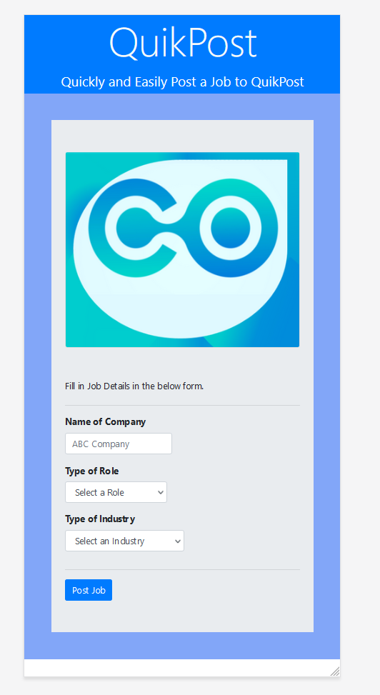

# React-Form

## To Run

---

### With Yarn (or replace yarn with npm)

```{shell}
$ yarn install
$ yarn run
```

### With Docker

**Ensure you have a .env with PORT var set before running (see .example.env)**

```{shell}
$ docker compose up -d -V
```

## App Views

---

### Desktop/Tablet


### Mobile



## Testing

---

run `yarn test` to run the example test suites. Tests included are not exhausitve.

[Test.md](https://github.com/cwils021/react-form/blob/master/src/__tests__/Test.md) includes a list of additional tests that could be written to test the application further.
